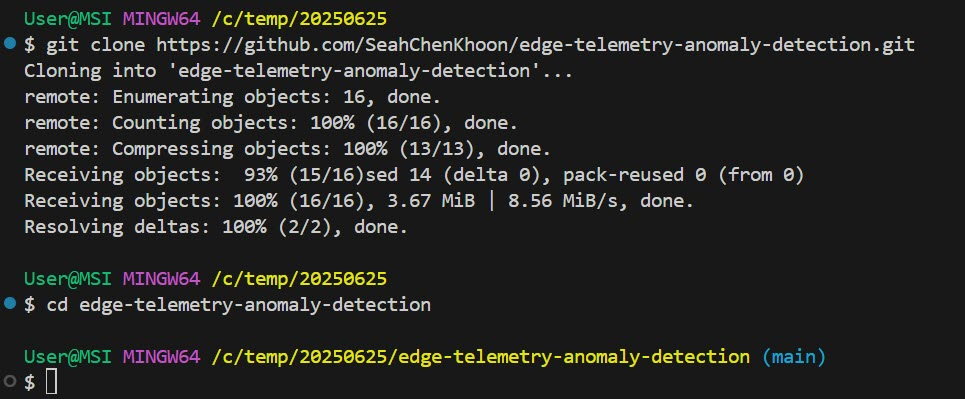
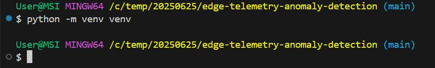

# Benchmarking Isolation Forest and ONNX-Accelerated Proxy Models for Anomaly Detection

This project compares the performance of a native `IsolationForest` model with an ONNX-accelerated proxy model for anomaly detection. Since `IsolationForest` is not natively supported in ONNX, a `RandomForestClassifier` was trained on its anomaly labels to act as a supervised proxy, allowing ONNX export.

All models were evaluated using CPU-only execution, with a focus on average inference time per sample and model file size. The ONNX model—despite being derived from a larger supervised model—achieved the fastest inference and demonstrated competitive model size, making it well-suited for deployment in latency-sensitive or resource-constrained environments.

---
## 🛰️ Project Overview

The **Anomaly Detection Optimization Framework** is a lightweight, deployment-ready pipeline for identifying abnormal patterns in telemetry data with minimal latency and resource overhead. It is purpose-built for **real-time anomaly detection in edge and embedded systems**, where compute and memory resources are limited.

The framework begins with exploratory analysis of telemetry metrics—such as CPU usage, memory consumption, network traffic, and task-level behaviors—drawn from a real-world dataset. An unsupervised `IsolationForest` model is first trained to detect anomalies. These outputs are then used as pseudo-labels to train a supervised `RandomForestClassifier`, which enables conversion to the **ONNX** format for efficient and portable inference.

To validate performance, the system benchmarks model size and average inference time across native and *ONNX* formats. The ONNX model runs **20–25× faster per sample** compared to the original implementation, while maintaining comparable anomaly detection logic. This confirms its suitability for streaming or batch inference in **CPU-only and resource-constrained environments.**

🔧 Key Use Cases:
- Improves flow and clarity with logical sequencing
- Uses consistent verb tense and more formal language
- Emphasizes ONNX advantages clearly (speed, portability)
- Adds sectioning (Key Use Cases) for readability

---

## 🔧 Features
- **Unsupervised anomaly detection** using IsolationForest on telemetry metrics (CPU, memory, power, etc.)
- **Supervised proxy modeling** via RandomForestClassifier trained on pseudo-labels for ONNX compatibility
- **ONNX model export** for platform-agnostic, deployment-ready inference
- **Simulated real-time benchmarking** with per-sample latency profiling on CPU
- **Telemetry dataset integratio**n via Hugging Face (intel-cpu-dataset)
- **Exploratory data analysis (EDA)** and anomaly score visualization to interpret model behavior
- **Model evaluation report** comparing file size and inference speed across native and ONNX formats

---

## 📁 Project Structure
``` text
├── .git/                          # Git repository folder (hidden)
├── data/
│   └── intel_cpu_dataset.csv      # Telemetry dataset (from Hugging Face)
├── images/
│   ├── 01_Clone_the_Repository.jpg
│   └── 02_Set_Up_a_Virtual_Environment.jpg
├── model/
│   ├── isolation_forest_optimized.pkl   # Trained Isolation Forest model
│   ├── RandomForestClassifier.pkl       # Supervised proxy model
│   └── rf_anomaly_detector.onnx         # ONNX-exported model for deployment
├── src/
│   └── EDA.ipynb                  # Notebook for data exploration and evaluation
├── .gitignore                    # Git ignore rules
└── README.md                     # Project overview and instructions
```
---
## 🔧 Installation
Follow these steps to set up and run the Edge Telemetry Anomaly Detection project:

1. Clone the Repository
Open your terminal (e.g., Git Bash), navigate to your desired directory, and run:
```
git clone https://github.com/SeahChenKhoon/edge-telemetry-anomaly-detection.git
cd edge-telemetry-anomaly-detection
```


2. Set Up a Virtual Environment
````text
python -m venv venv
venv\Scripts\activate  
````


3. Run the Notebook
- Launch Jupyter Notebook or JupyterLab:
- Open src/EDA.ipynb and run through the cells to:
  - Load telemetry data
  - Perform EDA
  - Train Isolation Forest and Random Forest proxy models
  - Export to ONNX
  - Run real-time inference benchmarks
---
## 📄 Project Report
#### 🧭 Scenario Overview

Modern edge devices and industrial systems increasingly depend on real-time telemetry data to maintain reliability, safety, and performance. These devices emit high-frequency metrics—such as CPU usage, memory consumption, execution time, and power draw—that can be monitored to detect early signs of stress, faults, or degradation.

This project aims to **develop and benchmark a lightweight anomaly detection pipeline** optimized for **resource-constrained environments**. Specifically, it supports:

- Real-time inference on CPU-only edge devices  
- Low memory and storage footprint  
- Accurate detection of abnormal behavior from telemetry inputs  

The solution employs a two-stage machine learning approach:  
- **Unsupervised learning** using `IsolationForest` for anomaly discovery  
- **Supervised proxy modeling** via `RandomForestClassifier`, trained on pseudo-labels to enable ONNX conversion  

The final goal is to compare both models and optimize for deployment using ONNX Runtime.

#### 📊 Chosen Dataset: Intel CPU Telemetry Dataset
- Dataset Name: `intel-cpu-dataset`
- Source: [Intel CPU Telemetry Dataset on Hugging Face](https://huggingface.co/datasets/MounikaV/intel-cpu-dataset)
- Format: CSV (12 columns × 2081 rows)


#### 🧾 Features Included

| Feature Name                   | Description                                                                 |
|-------------------------------|-----------------------------------------------------------------------------|
| `vm_id`, `timestamp`          | Unique identifiers for each virtual machine and time record                |
| `cpu_usage`                   | CPU utilization percentage (`0–100%`)                                      |
| `memory_usage`                | Memory usage in megabytes (MB)                                             |
| `network_traffic`             | Network throughput in megabytes per second (MB/s)                          |
| `power_consumption`           | Power usage in watts (W)                                                   |
| `num_executed_instructions`   | Total instructions executed during the task                                |
| `execution_time`              | Task completion time in milliseconds (ms)                                  |
| `energy_efficiency`           | Computed metric: `instructions / (power * time)`                           |
| `task_priority`               | Integer score denoting task importance or urgency                          |
| `task_type_compute`           | Binary flag: 1 if task is compute-intensive, else 0                        |
| `task_type_io`                | Binary flag: 1 if task is I/O-bound, else 0                                |
| `task_type_network`           | Binary flag: 1 if task is network-related, else 0                          |
| `task_status`                 | Ground truth label: `0` = normal, `1` = failure                            |

#### 🧠 Relevance to PC Telemetry
This dataset mirrors the type of low-level hardware telemetry commonly collected in edge and embedded monitoring systems. Each row captures a moment-in-time snapshot of system performance during task execution, accompanied by a label indicating normal or failed behavior. This structure makes it highly suitable for training and evaluating anomaly detection models.

The features closely reflect standard PC and embedded telemetry signals, including:
- Resource consumption — CPU usage, memory usage
- Efficiency metrics — power draw, execution time, energy efficiency
- Operational context — task type (compute, I/O, network) and priority level

Together, these attributes simulate real-world data streams from platforms such as industrial PCs, embedded controllers, and IoT devices, making the dataset a realistic and valuable proxy for practical anomaly detection in telemetry-rich environments.


### 🔍 Key Findings from EDA
The exploratory data analysis (EDA) revealed distinct patterns separating normal and anomalous task executions in the telemetry dataset:
| Aspect              | Normal Behavior                               | Anomalous Behavior (Failures)                          |
|---------------------|------------------------------------------------|--------------------------------------------------------|
| `cpu_usage`         | Typically moderate (20–60%)                   | Spikes above 80% or unusually low idle usage          |
| `memory_usage`      | Stays within consistent mid-range levels      | Abrupt surges or drops near capacity limits           |
| `network_traffic`   | Aligned with expected task profiles           | Unexpected inactivity or sudden drops in throughput   |
| `power_consumption` | Proportional to resource usage                | High draw with little corresponding output            |
| `execution_time`    | Predictable per task type                     | Frequently delayed or irregular durations             |
| `energy_efficiency` | Consistently high (effective performance/watt)| Noticeable decline, indicating inefficiency           |
| `task_status`       | `0` (Normal execution)                        | `1` (Labeled failure or anomaly)                      |

#### 📈 Distributional Insight:
- **Anomaly scores** from IsolationForest exhibited a right-skewed distribution, with **failed samples consistently scoring higher**, indicating stronger outlier behavior.
- **Visual analysis** revealed that anomalies tend to **cluster around extreme feature values**, such as **high power consumption**, **prolonged execution time**, and **low energy efficiency**, reinforcing their separation from normal operational patterns.


#### 🧠 Interpretation:
These patterns indicate that anomalous system behavior is typically **resource-inefficient, inconsistent in execution time**, or **misaligned with expected task characteristics**. Such clear deviations make the dataset well-suited for anomaly detection using both **unsupervised** and **supervised** machine learning approaches.


### 🧠 Model Approach and Reasoning
This project adopts a **hybrid machine learning strategy** to detect anomalies in telemetry data, leveraging the strengths of both modeling paradigms. The approach combines:
- **Unsupervised learning** (IsolationForest) to assign anomaly scores without requiring labeled data
- **Supervised learning** (RandomForestClassifier) trained on pseudo-labels for compatibility with ONNX export and efficient deployment

#### 🔍 1. Algorithm Choice
| Model Type           | Algorithm              | Purpose                                                                 |
|----------------------|------------------------|-------------------------------------------------------------------------|
| `Unsupervised Model` | `IsolationForest`      | Detect anomalies directly from data without labeled failures           |
| `Supervised Proxy`   | `RandomForestClassifier` | Trained using pseudo-labels from `IsolationForest` to mimic behavior   |

- Why Isolation Forest?
  - Efficient and effective at detecting outliers in high-dimensional telemetry data.
  - Requires no labeled training data, making it ideal for real-world edge cases.

- Why Random Forest Proxy?
  - Converts unsupervised insights into a supervised format.
  - Enables export to ONNX, allowing for optimized, low-latency edge inference.

#### 🧬 2. Features Used
- The following telemetry features were used as input to both models:
  - `cpu_usage`, `memory_usage`, `network_traffic`, `power_consumption`
  - `num_executed_instructions`, `execution_time`, `energy_efficiency`
  - `task_priority`, `task_type_compute`, `task_type_io`, `task_type_network`

#### 📊 3. Performance Metrics
| Metric            | Description                                                       |
|-------------------|-------------------------------------------------------------------|
| `Inference Time`  | Avg time per sample measured on CPU for both models              |
| `Model Size`      | File size comparison (`.pkl` vs `.onnx`)                          |
| `ONNX Optimization` | Inference speedup (~25× faster than raw scikit-learn model)     |

Performance results showed:
- Inference time for the ONNX model: 0.000052 s/sample
- Inference time for the Isolation Forest model: 0.002573 s/sample
- Inference time for the Random Forest model: 0.002832 s/sample
- ONNX model is ~2.2× larger than the Random Forest model, but ~54× faster in inference
- ONNX model is ~2.4× smaller than the Isolation Forest model, yet delivers ~49× faster inference

These results highlight the ONNX model's suitability for real-time, CPU-only deployment in edge environments.


### ⚙️ Model Optimization and Impact
To enable efficient **edge deployment**, the scikit-learn model (`RandomForestClassifier`) was converted to **ONNX format** using skl2onnx. While `IsolationForest` is not directly supported in ONNX, we used it to generate **pseudo-labels** for training a compatible `RandomForestClassifier`. This proxy model enabled export to ONNX format and benefited from faster inference and reduced overhead in runtime environments.

#### 🚀 Optimization Summary
- **Technique**: Scikit-learn → ONNX conversion using skl2onnx
- **Target**: Reduce inference latency and improve portability to edge devices
- **Result**: Significant speed-up (25× faster) and modest increase in model size

### 📊 Performance Comparison

| Metric           | Isolation Forest (.pkl) | Random Forest (.pkl) | ONNX (.onnx)         | ONNX Improvement                                                    |
|------------------|--------------------------|------------------------|-----------------------|----------------------------------------------------------------------|
| File Size (KB)   | 1139.14 KB               | 214.80 KB              | 470.51 KB             | ~2.4× smaller than Isolation Forest, ~2.2× larger than Random Forest |
| Inference Time   | 0.002573 sec/sample      | 0.002832 sec/sample    | 0.000052 sec/sample   | ~49× faster than Isolation Forest, ~54× faster than Random Forest    |
| GPU Used         | ❌                       | ❌                     | ❌                    | CPU-only execution for all                                           |

#### 📌 Observations
- The ONNX model offers the best trade-off between speed and size for deployment.
- It is approximately 49× faster than Isolation Forest and 54× faster than Random Forest in per-sample inference time.
- Despite being 2.2× larger than the Random Forest model, ONNX is still 2.4× smaller than the Isolation Forest model.
- All models were executed without GPU acceleration, confirming ONNX's suitability for real-time, CPU-only environments.
- The Random Forest model serves as an effective supervised proxy for converting unsupervised anomaly detection into an ONNX-compatible format.


### 🖥️ Integration into a Dell PC Environment

To integrate this anomaly detection model into a Dell PC, we envision the following setup:

#### 🔄 Background Service Design
- A **lightweight Python-based background service** runs periodically or continuously on the user’s PC.
- This service **collects telemetry** (e.g., CPU usage, power consumption, memory, etc.) through system APIs or lightweight agents.
- The telemetry data is then **preprocessed and passed to the ONNX model** for real-time anomaly inference.

#### 🔧 Assumptions and Environment
- **Python 3.10+** is pre-installed on the system.
- Required packages like `onnxruntime`, `psutil`, and `numpy` are bundled with the service or installed via an installer.
- The **ONNX model is precompiled and lightweight**, making it ideal for resource-constrained environments.
- A **virtual environment or embedded interpreter** can be used to avoid conflicting with system Python installations.

#### 🔁 Inference Workflow
1. Collect telemetry data at regular intervals (e.g., every 10 seconds).
2. Convert data into a float32 array and feed it into the ONNX model.
3. If the model detects an anomaly (`Warning` or `Critical`), log the event and optionally escalate.

#### 🛠️ Production Considerations
- In a production setting, this system may be **converted to C++**  for performance and native integration.
- For higher security environments, **telemetry sharing can be opt-in**, with options for `local-only` or `cloud-escalation` mode.

#### 📡 Optional Cloud Extension
- In “`share_with_dell`” mode, anomalous events may be **forwarded to Dell’s cloud** for remote diagnostics or support automation, enabled via HTTPS API calls.

This setup allows for **scalable, privacy-aware, and hardware-friendly anomaly detection** directly at the edge, helping identify issues before they affect user experience or system stability.

## 👤 Author
Seah Chen Khoon

Last updated: 26 June 2025